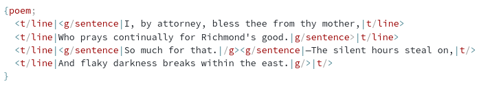

# CPTML

CPTML = Curly & Pointy Tags Markup Language

(also joke with CPTM: *Companhia Paulista de Trens Metropolitanos*)

## Main features

  * Compact syntax: ```{tag attr="value"; inner text}```
  * Namespace support: ```{ns1:tag ns2:attr="value"; inner text}```
  * Typed attributes (string, int, float or boolean).
  * Native support for including other files.
  * Overlapping markup support via multiple trees/views.
  * Text and comments show as special elements on the tree/API.
  * C-style escape sequences. (no XML entities nonsense)
  * Nice syntax for escaped text: ```` ``` ```` (for code blocks), ```$$``` (for LaTeX display math) and ```$``` (for LaTeX inline math).

## Examples

### US Constitution (Article I Section I)

```cptml
{preamble !id="preamble";
	{recital !id="s1"; {inline name="small-caps"; We the People} of the United States, in Order to form a more perfect Union, establish Justice, insure domestic Tranquility, provide for the common defence, promote the general Welfare, and secure the Blessings of Liberty to ourselves and our Posterity, do ordain and establish this Constitution for the United States of America.}}
{article !id="article-I";
  {num value="I"; ARTICLE I.}
  {section !id="article-I-1";
    {num value="1"; Section 1.}
    {text id="s3"; All legislative Powers herein granted shall be vested in a Congress of the United States, which shall consist of a Senate and House of Representatives.}
}}
```


Text source: https://github.com/usgpo/house-manual/blob/master/114/original-file-names/constitution.xml

### Overlapping Markup

This document has three views: the empty/default one, `t` for typography and `g` for grammar.

Note that ending tags can be abbreviated: `|>` (default namespace) and `|(t)>` (for view `t`).

```cptml
{poem;
  <(t)line|<(g)sentence|I, by attorney, bless thee from thy mother,|(t)line>
  <(t)line|Who prays continually for Richmond's good.|(g)sentence>|(t)line>
  <(t)line|<(g)sentence|So much for that.|(g)><(g)sentence|—The silent hours steal on,|(t)>
  <(t)line|And flaky darkness breaks within the east.|(g)>|(t)>
}
```



Text source: https://en.wikipedia.org/wiki/Overlapping_markup#Milestones

### Math

```cptml
{p; The quadratic formula is below:}

$$ \frac{-b\pm\sqrt{b^2-4ac}}{2a} $$
```

## Escape sequences

  * `\a`: Alert or bell
  * `\b`: Backspace
  * `\\`: Backslash
  * `\s`: Whitespace
  * `\t`: Horizontal tab
  * `\n`: Line feed or newline
  * `\f`: Form feed
  * `\r`: Carriage return
  * `\uN...N;`: Unicode code point (where `N...N` is one or more hexadecimal digits)
  * `\v`: Vertical tab
  * `\'`: Single quote
  * `\"`: Double quote
  * `\{`: Begin curly brace
  * `\}`: End curly brace
  * `<`: Less than
  * `>`: Greate than
  * `\|`: Vertical pipe
  * <code>\`</code>: Back tick

## Special Elements

### `!cptml`

Indicated the file type and version.

### `!schema`

Specifies where the schema is locate and defines namespaces.

Attributes:

  * `ns` (optional): string with the namespace prefix.
  * `!href` (optional): the location where the schema is available.

### `!root`

Exists just to make sure all documents have a non empty root. This is never transcribed to output.

### `!include`

Indicates that another file is to be included. By default, it is included as if it were properly escaped text.

Attributes:

  * `!id` (optional)
  * `src` (required): string with a file path
  * `parse` (optional): if `true`, will parse the referenced file as CPTML.

Note: by default `!include` nodes won't appear on the tree and won't be considered when processing tree paths.

### `!text`

Represents a text node. It is essentially a "virtual element" used to simplify the APIs and canonize documents.

Attributes:

  * `val`: the textual data as a string including only the relevant whitespace.
  * `kind`: one of the following values `"inline"`, `"fenced"`, `"math-inline"`, `"math-display"`, `"comment"`.

## Special Attributes

Any regular elements may have the following attributes which work across name spaces.

  * `!id`: equivalent of `xml:id`
  * `!lang`: equivalent of `xml:lang`

## Tree Paths

Very similar to XPath but simpler.

The following selectors are available:

* `.`: context node.
* `..`: parent of the context node.
* `*`: all children of the context node (except `!text`).
* `node()`, `**`: all children of the context node including text.
* `text()`: all text children of the context node.
* `inner-text()`: a single string with all the text under the context node.
* `tag`: all child elements with a name matching the `tag`.
* `@name`: attribute `name` of the context node.
* `@*`: all attributes of the context node.
* `/`: root element when used at the start of a path.
* `//`: all descendants of the root when used at the start of a path.
* `//`: all descendants of the context node.

The following basic filters are supported:

* `[@attrib]`: keep elements with an attribute named `attrib`.
* `[@attrib='val']`: keep elements with an attribute named `attrib` and value matching `val`.
* `[tag]`           keep elements with a child element named `tag`.
* `[tag='val']`     keep elements with a child element named `tag` and text matching `val`.
* `[n]`: keep the `n`-th element, where `n` is a numeric index starting from 1.

The following function-based filters are supported:

* `[text()]`: keep elements with non-empty text.
* `[text()='val']`: keep elements whose text matches `val`.

The following set operators are supported:

* ` + `: union of two sets (like ` | ` in XPath)
* ` - `: subtraction of two sets
* ` & `: intersection of two sets

The view is specified in the beginning of the path and separated with a vertical pipe. Ex: `v|/root/child`

## API

*Warning: Work in Progress*

```idl
interface Document {
  attribute sequence<Node> Nodes;
  // namespace prefix -> namespace URI
  attribute record<UTF8String, UTF8String> Namespaces;
  attribute boolean IgnoreIncludes;

  UTF8String     writeAsString();
  ByteString     writeAsBytes();

  Node           getRoot();
  Node?          getOneByPath(UTF8String path);
  sequence<Node> getAllByPath(UTF8String path);

  void           addNamespace(UTF8String prefix, UTF8String uri);
  boolean        hasNamespace(UTF8String prefixOrUri);
  // returns false if there are elements with the requested namespace
  boolean        delNamespace(UTF8String prefixOrUri);

}

interface Name {
  attribute UTF8String FullNamespace;
  attribute UTF8String NamespacePrefix;
  attribute UTF8String LocalName;
  attribute Document document;

  UTF8String     getShort();
  UTF8String     getLong();
  // Return false if the namespace isn't set up on the document
  boolean        setShort(UTF8String newName);
  boolean        setLong(UTF8String newName);
}

enum NodeKind {
	"text",
	"comment",
	"element",
	"marker"
};

enum AttrValueType {
	"string",
	"int",
	"float",
	"boolean",
	"none"
};

typedef (UTF8String or
         int or
         float or
         boolean) AttrValue;

interface Node {
  attribute Name Name;
  attribute sequence<Attribute> Attributes;
  attribute sequence<Node> Children;
  attribute UTF8String view;

  NodeKind        nodeKind();
  UTF8String      getInnerText();
  UTF8String      getPath();
  UTF8String      getPathRelativeTo(Node node);
  Node?           getParent();
  void            setParent(Node newParent);

  Node            deepCopy();
  Node            shallowCopy();

  Node?           getOneByPath(UTF8String path);
  sequence<Node>  getAllByPath(UTF8String path);
  
  // indexes count text nodes
  void            addChildAfter(Node child, int index);
  Node?           getChildAt(int index);
  boolean         delChildAt(int index);
  void            addChild(Node child);
  boolean         delChild(Node child);
  boolean         replaceChild(Node old, Node new);

  void            sortAttributes();
  boolean         hasAttribute(Name name);
  void            delAttribute(Name name);
  
  AttrValue?      getAttribute(Name name);
  AttrValueType   getAttributeType(Name name);
  UTF8String?     getAttributeAsStr(Name name);
  int?            getAttributeAsInt(Name name);
  boolean?        getAttributeAsBool(Name name);
  int?            getAttributeAsFloat(Name name);

  void            setAttribute(Name name, AttributeValue? name);
  void            setAttributeStr(Name name, UTF8String value);
  void            setAttributeInt(Name name, int value);
  void            setAttributeBool(Name name, boolean value);
  void            setAttributeFloat(Name name, float value);
};
```


